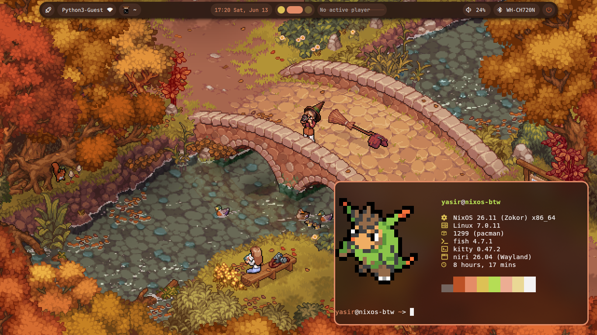
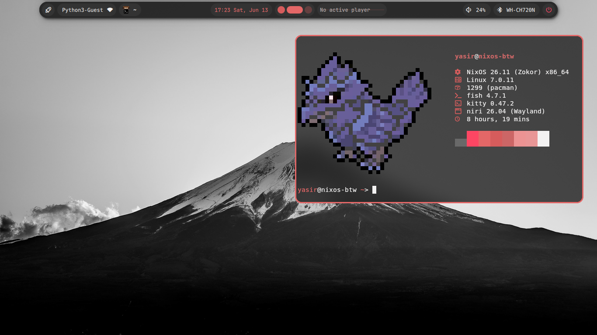
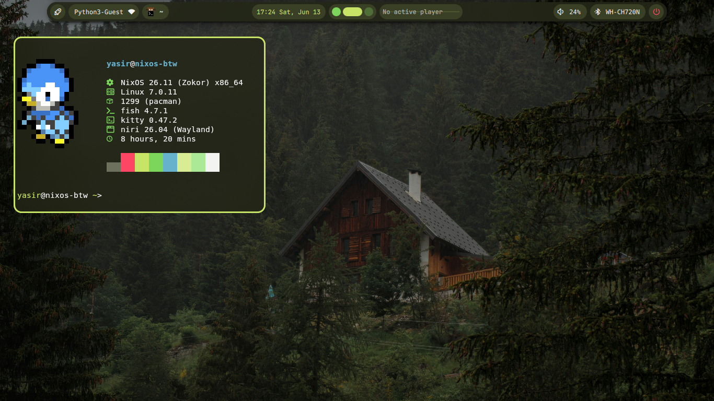

# NixOS Configuration  
⚠️ **UNDER CONSTRUCTION** ⚠️
- in a testing phase right now
- trying to figure out how to move all configs into this
- don't use this pls pls pls pls pls pls pls
  
### What this aims to be:
- a reproducible niri setup configuration that primarily uses [`noctalia-shell`](https://github.com/noctalia-dev/noctalia)
  



  
### Usage:
``` fish
git clone https://github.com/yasir1-bot/dotfiles.git
cd dotfiles
sudo nixos-rebuild switch --flake .#nixos-btw
```
